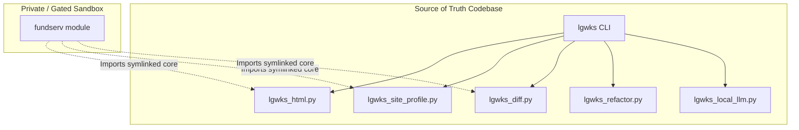

# Logical Works Core (`lgwks`)

> [!IMPORTANT]
> **Source of Truth Declaration:** This repository (`logicalworks-`) serves as the official, canonical source of truth for all core Logical Works modules, parser engines, utility functions, site profiles, and CLI configurations. All sister repositories, including private work environments like `cl-ideas`, import or symlink directly from this codebase to consume its engines.

`lgwks` is a local-first, privacy-respecting developer research and code refactoring toolchain. It runs entirely offline under Enterprise Privilege Management (EPM) restrictions, using local CoreML/ANE models and containerized local LLM options to process documents and code without external cloud calls.

---

## 1. System Architecture



---

## 2. Core Capabilities

### A. Global HTML-to-Markdown Scraper (`lgwks_html.py`)
Provides deterministic, boilerplate-free document extraction modeled after Crawl4AI and Firecrawl:
- Strips headers, footers, navigation, styles, scripts, and cookie consent banners.
- Reconstructs complex HTML tables with `rowspan` and `colspan` grid layout carrying.
- Automatically differentiates between ordered (`ol` -> `1. `) and unordered (`ul` -> `- `) list syntax by walking the parent tag stack.

### B. Semantic Diff Engine (`lgwks_diff.py`)
Extracts structural modifications, insertions, and deletions across two sets of parsed document chunks or Markdown files:
- Exact matches identified via SHA-256 hashes.
- Partial matches identified using Difflib sequence matching ratios.

### C. AST-Based Code Refactoring Engine (`lgwks_refactor.py`)
Provides safe, deterministic transformations on Python source files without using LLM generation:
- Renaming symbols (variable names, arguments, functions, classes).
- Extracting blocks into new functions/methods.
- Inserting type annotations dynamically based on a target parameter mapping.
- Removing unused imports based on name reference collection.

### D. Local LLM Bridge (`lgwks_local_llm.py`)
Thin, local-only bridge to a containerized Ollama instance running in Docker Desktop on Mac:
- Integrates small models like `qwen2.5-coder:1.5b` for offline coding assistant tasks.
- Degrades gracefully (no errors or locks) if the Docker container is stopped.

---

## 3. CLI Reference

`lgwks` is the canonical entrypoint. Sidecar tools like the research driver, auth vault, agent-os
bootstrap, context packer, execution spine, and model hub are available as subcommands under the
same binary:

```bash
./lgwks agent-os doctor
./lgwks auth ls
./lgwks akinator --demo
./lgwks run --demo
./lgwks context path/to/run
./lgwks model-hub list
```

Run the self-tests to verify your install health:
```bash
./lgwks doctor
```

### Research Crawl
To run the research crawler:
```bash
./lgwks jarvis crawl <url>
```

### Single-Page Fetch
To render and extract one page in a browser:
```bash
./lgwks fetch <url>
```

### Refactoring
Deterministic AST modifications:
```bash
# Preview modifications first
./lgwks refactor --file path/to/code.py --preview rename --old old_func --new new_func

# Apply modifications directly
./lgwks refactor --file path/to/code.py rename --old old_func --new new_func
```

---

## 4. Symlink Configuration in `cl-ideas`

To consume core changes inside `cl-ideas/fundserv/`, symlinks are established in the root of `cl-ideas` pointing back to `logicalworks-`:
```bash
cd cl-ideas
ln -sf /Users/srinji/logicalworks-/lgwks_html.py .
ln -sf /Users/srinji/logicalworks-/lgwks_site_profile.py .
ln -sf /Users/srinji/logicalworks-/lgwks_diff.py .
ln -sf /Users/srinji/logicalworks-/lgwks_refactor.py .
ln -sf /Users/srinji/logicalworks-/lgwks_local_llm.py .
```
This guarantees that all improvements to the core parser, diff utility, or CLI immediately benefit the private authenticated standard crawler pipeline.
