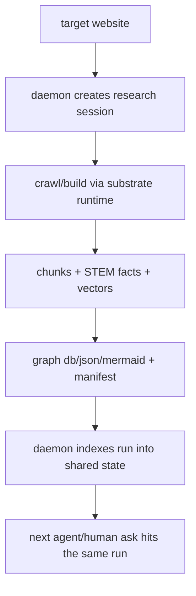

# Daemon Core Plan

Status: active plan · scope: the vendor-neutral daemon core plus the first research experience

This is the cohesive plan after the current architecture cut:

- defer human projection
- keep ingress headstart
- use transcript/history tail as the simpler outbound truth
- treat daemon and ingest as one runtime
- make clients adapters, not product centers
- build concurrency and referee behavior in from day 1

One important correction:

- the daemon is **not already a Rust core**
- Rust exists today in the crawler and Axiom islands
- a Rust daemon is a likely target seam once contracts stabilize

## 1. Core node to finish

Finish this node first:

```text
ingress adapter
-> daemon queue/session
-> workflow/retrieval runtime
-> shared state substrate
-> packet response
-> transcript tail continues state updates
```

If this node works, Claude/Codex/Gemini become adapters instead of architecture forks.

Additional hard requirement:

> one tenant may run multiple frontier agents concurrently, and the daemon is the referee across them

The day-1 bar is at least:

- Claude
- Codex
- Gemini

running at the same time within one tenant.

## 2. What is done

Built enough to rely on:

- ingress/reflex pieces
  - `lgwks_map.py`
  - `lgwks_engine.py`
  - `lgwks_inbound.py`
  - `hooks/subconscious_inbound.py`

- ingestion/retrieval substrate
  - `lgwks_input.py`
  - `lgwks_lfm2_extract.py`
  - `lgwks_embed_port.py`
  - `lgwks_vector.py`
  - `lgwks_score.py`
  - `lgwks_rank.py`
  - `lgwks_entity_graph.py`
  - `lgwks_substrate_run.py`

- workflow/runtime surfaces
  - `lgwks_do.py`
  - `lgwks_workflows.py`
  - `lgwks_run.py`
  - `lgwks_repo.py`
  - `lgwks_spawn.py`
  - `lgwks_agent_os.py`

- state/security substrate
  - `lgwks_sqlite.py`
  - `lgwks_cognition.py`
  - `lgwks_access.py`
  - `lgwks_capability.py`
  - `lgwks_crdt.py`
  - `lgwks_sign.py`

- research output shape
  - `lgwks_manifest.py`
  - `lgwks_ingest.py`
  - `lgwks_research.py`

## 3. What is left

### P0. Daemon lifecycle and packet API

Need one owned daemon process with:

- single-writer state ownership
- per-session identity
- queue/enqueue API
- read packet API
- crash-safe restart
- shared-referee scheduling across concurrent agent workloads
- per-agent subconscious packet generation over shared tenant state

Acceptance:

- daemon can be started independently of any client
- ingress can enqueue work
- packet can be fetched deterministically by session
- restart loses no committed state
- three concurrent agent sessions in one tenant do not corrupt state or lose updates
- shared jobs are arbitrated once; agent-local packets remain distinct

Implementation note:

- do this in Python first unless/until the queue/state contract is stable enough to migrate
- if/when migrated, Rust should own the single-writer backend, not fork the business rules

### P1. Ingress and transcript normalization

Need one normalized event model for:

- inbound human message
- transcript turn
- tool call
- file change
- workflow event

Acceptance:

- Claude ingress hook produces the same normalized event shape as a later transcript tail event
- Codex/Gemini adapters can submit equivalent events without special-casing the core
- every normalized event is attributable to both `tenant` and `agent/session`

### P2. Daemon-owned git/worktree runtime

Need the daemon to own:

- worktree setup
- worktree cleanup
- git alignment
- CRDT-backed concurrent state behavior

Acceptance:

- daemon can create/update/close a worktree session without manual shell choreography
- state merges remain auditable
- conflicting repo actions across concurrent agents are serialized or rejected by referee policy, never raced

### P3. Research run front door

Need one obvious command/runtime surface for:

- target website
- crawl/build/map
- graph artifacts
- embeddings
- STEM facts and DB outputs
- future queryability by the daemon

Acceptance:

- one command or one actor run produces a complete research substrate
- daemon can index that run and serve later packets from it

Real-world constraints to respect:

- bounded crawl budgets
- auth wall escalation instead of silent scrape failure
- explicit storage tiering for large media/vector runs
- promotion rules for what becomes durable shared knowledge

### P4. Client adapters

Need thin adapters for:

- Claude
- Codex
- Gemini

Acceptance:

- same core packet contract
- no client-specific business logic in the daemon core
- adapters identify the caller cleanly enough for per-agent subconscious state and referee arbitration

### P5. Archive/export tier

Need:

- verified cloud export
- retention policy
- safe local cleanup after export

Acceptance:

- session/run export is content-addressed and auditable
- local cleanup never occurs before verified export

## 4. First concrete experience: website research

The first thing to get running end to end should be:

> I point it at a website and it comprehensively makes me a graph/map, embeddings, STEM facts, and a reusable substrate for future agent work.

That runtime should be:



### What already exists for this experience

- crawl/build surfaces in `lgwks_manifest.py`
- pipeline/runtime in `lgwks_substrate_run.py`
- end-to-end ingest path in `lgwks_ingest.py`
- autonomous research loop in `lgwks_research.py`
- graph output and viz support in `lgwks_graph_viz.py`

### What is missing for this experience

- one canonical research session front door
- one manifest packet that the daemon always knows how to ingest
- one daemon index step that registers the run into long-lived state
- one query surface for later recall

## 5. The next few moves

1. ✅ Normalize the daemon event model.
   Status: DONE — `lgwks.daemon.event.v1` + store append + session heads (2026-06-12, `18f0ecf`/`7bfdd84`)

2. ✅ Build the daemon lifecycle shell + work queue + packet read.
   Status: DONE — start/stop/status/doctor + poll loop + enqueue/dequeue (IMMEDIATE, no double-claim)
   + `get_packet()` deterministic snapshot (2026-06-12, `464c470`)

3. ✅ Research-session front door + run registry.
   Status: DONE — `daemon research <url>` calls `build_run()`, registers manifest via `register_run()`;
   `daemon runs` lists indexed runs; `research_run` dispatcher in poll loop (2026-06-12, `bc3b67e`)

4. ✅ Daemon indexes completed research run.
   Status: DONE — bundled with Move 3. Migration v3 `daemon_runs` table; idempotent by run_id.

5. ✅ Claude adapter.
   Status: DONE — `hooks/subconscious_inbound.py` emits `human_message` (lane=ingress, client=claude)
   to daemon store on every prompt; fail-silent (INV-6); session_id from LGWKS_TRANSCRIPT_PATH
   (2026-06-12, `fe400a4`)

6. Add Codex and Gemini as thin clients after the daemon contract is stable.
   Status: OPEN — next queue item. Same event contract; thin adapter per client.

## 6. Decision rules

- Keep `complex math -> ML -> SLM if needed`.
- Prefer MLX over llama.cpp when practical.
- Use hooks as adapters, not as the core truth source.
- Use transcript/history tails as the simplest durable outbound source when the client provides them.
- Extend built surfaces before minting new ones.
- Bin work explicitly by latency, trust, storage, and compute class before choosing where it runs.
- Distinguish `shared-referee` work from `agent-local subconscious` work in every runtime decision.
