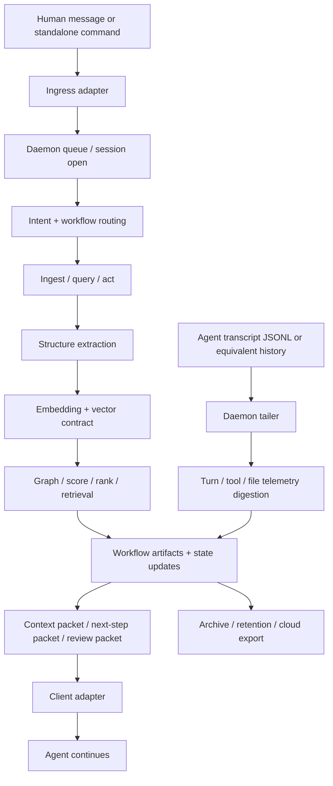
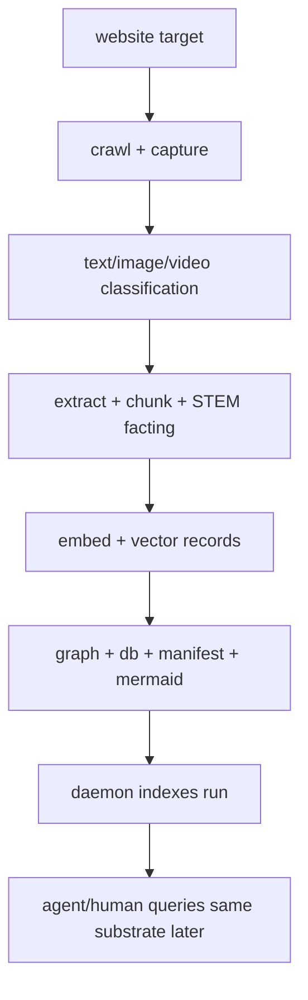

# Operating Model — daemon, ingest, nerves, adapters

Status: active synthesis · audience: human + coding agents · purpose: describe the real runtime shape of `lgwks` from built modules first, then the remaining gaps.

This document is the compression layer between the repo atlas and the PRDs.

Read this after [navmap/README.md](/Users/srinji/logicalworks-/docs/navmap/README.md) when the question is:

> What is the system actually doing, how do the lanes intersect, and what is the real end state?

## 1. Product cut

The core is **not**:

- a Claude-only hook pack
- a human cockpit
- a pile of workflows

The core **is**:

> a local daemonized context-and-digestion engine that continuously builds, updates, and serves structured understanding of work

Everything else is an adapter or projection.

For now, defer the human projection. Keep the input headstart hook. Treat outbound transcript tailing as the simpler truth source.

Within one tenant, this daemon is also the referee across concurrent frontier agents. It does not replace their individual subconscious views; it coordinates them.

## 2. The canonical runtime graph



This is the full digestion system:

- ingress gives the daemon a headstart
- the daemon and ingest largely share one runtime
- transcript telemetry keeps feeding the same state after the explicit request
- the output is a bounded packet, not free prose

## 2.1 Referee + individual subconsciouses

The daemon has two roles at once:

1. `shared referee`
   Tenant-wide arbitration over queueing, state ownership, worktree/git actions,
   retrieval freshness, and concurrent side effects.
2. `agent-local subconscious`
   Each active agent still gets its own bounded context packet, tuned to its turn,
   history, and task position.

So the target shape is:

- one shared referee/runtime
- many per-agent subconscious packets derived from the same substrate

Not:

- one giant shared brain that every agent reads identically

## 3. The two active lanes

## 3.1 Ingress lane

This lane exists to get work started early and cheaply.

Desired behavior:

1. human sends a message
2. ingress adapter copies/sends it to the daemon first
3. daemon cleans, routes, and precomputes context
4. agent receives the bounded result and continues

This is the headstart lane. It is not the source of truth for everything; it is the fast-start lane.

Built anchors:

- [hooks/subconscious_inbound.py](/Users/srinji/logicalworks-/hooks/subconscious_inbound.py)
- [lgwks_engine.py](/Users/srinji/logicalworks-/lgwks_engine.py)
- [lgwks_inbound.py](/Users/srinji/logicalworks-/lgwks_inbound.py)
- [lgwks_map.py](/Users/srinji/logicalworks-/lgwks_map.py)

What is already true:

- inbound hook path exists
- deterministic schema generation exists
- bounded reflex packing exists

What is still missing:

- daemon-first ingress as the canonical runtime path
- session-aware enqueue and replay
- cross-client normalization of incoming turns

## 3.2 Telemetry lane

This lane exists to keep working after the message was sent.

Desired behavior:

1. agent works normally
2. transcript/history stream is tailed continuously
3. daemon digests tool calls, outputs, file changes, and session progress
4. state is updated without needing more human input
5. next ingress gets a better packet because the daemon stayed awake

For Claude, the simplest outbound architecture is the JSONL tail, not a special stop-hook.

Day-1 concurrency requirement:

- one tenant may have multiple active frontier agents at once
- the daemon must referee them from the start
- the initial bar is at least `Claude + Codex + Gemini` concurrently within one tenant

Built anchors:

- [lgwks_session.py](/Users/srinji/logicalworks-/lgwks_session.py)
- [lgwks_hooks.py](/Users/srinji/logicalworks-/lgwks_hooks.py)
- [lgwks_waste.py](/Users/srinji/logicalworks-/lgwks_waste.py)
- [spec/second-harness/prd/PRD-08-daemon-state-governance.md](/Users/srinji/logicalworks-/spec/second-harness/prd/PRD-08-daemon-state-governance.md)

What is already true:

- the repo has the right state/audit primitives
- the subconscious loop already assumes transcript-aware operation

What is still missing:

- one owned daemon process with single-writer lifecycle
- transcript normalization across clients
- failure/feed/state DB as a real runtime surface

## 4. Daemon and ingest are one runtime

Do not model these as two separate products.

The daemon runtime and the ingest runtime share:

- storage
- vectors
- graph
- workflow artifacts
- ranking and review
- audit chain

So the cleaner architecture is:

```text
daemon runtime
  = ingress handling
  + transcript digestion
  + ingest/query workflows
  + state updates
  + packet serving
```

Inside that runtime there are two scheduling domains:

- `shared-referee`
  tenant queue, git/worktree ownership, CRDT/state merge, crawl/index jobs, promotion rules
- `agent-local`
  per-agent context synthesis, task-local retrieval, task-local deltas, turn-aware suggestions

Built anchors:

- [lgwks_substrate_run.py](/Users/srinji/logicalworks-/lgwks_substrate_run.py)
- [lgwks_ingest.py](/Users/srinji/logicalworks-/lgwks_ingest.py)
- [lgwks_vector.py](/Users/srinji/logicalworks-/lgwks_vector.py)
- [lgwks_score.py](/Users/srinji/logicalworks-/lgwks_score.py)
- [lgwks_rank.py](/Users/srinji/logicalworks-/lgwks_rank.py)
- [lgwks_entity_graph.py](/Users/srinji/logicalworks-/lgwks_entity_graph.py)
- [lgwks_sqlite.py](/Users/srinji/logicalworks-/lgwks_sqlite.py)

## 5. The actual nerves

If the daemon is the nervous system, these are the real nerves:

### Sensory nerves

- input modality detection
- browser/crawl capture
- transcript/session tailing
- filesystem/worktree observation

Built modules:

- [lgwks_input.py](/Users/srinji/logicalworks-/lgwks_input.py)
- [lgwks_browser.py](/Users/srinji/logicalworks-/lgwks_browser.py)
- [lgwks_substrate_crawl.py](/Users/srinji/logicalworks-/lgwks_substrate_crawl.py)
- [lgwks_session.py](/Users/srinji/logicalworks-/lgwks_session.py)

### Compression nerves

- extract
- chunk
- schema-fill
- embed
- graphify

Built modules:

- [lgwks_extract.py](/Users/srinji/logicalworks-/lgwks_extract.py)
- [lgwks_lfm2_extract.py](/Users/srinji/logicalworks-/lgwks_lfm2_extract.py)
- [lgwks_embed_port.py](/Users/srinji/logicalworks-/lgwks_embed_port.py)
- [lgwks_substrate_text.py](/Users/srinji/logicalworks-/lgwks_substrate_text.py)
- [lgwks_entity_graph.py](/Users/srinji/logicalworks-/lgwks_entity_graph.py)

### Judgment nerves

- score
- rank
- review
- gates
- waste/risk ledgers

Built modules:

- [lgwks_score.py](/Users/srinji/logicalworks-/lgwks_score.py)
- [lgwks_rank.py](/Users/srinji/logicalworks-/lgwks_rank.py)
- [lgwks_review.py](/Users/srinji/logicalworks-/lgwks_review.py)
- [lgwks_verify.py](/Users/srinji/logicalworks-/lgwks_verify.py)
- [lgwks_gate_arch.py](/Users/srinji/logicalworks-/lgwks_gate_arch.py)
- [lgwks_gate_framework.py](/Users/srinji/logicalworks-/lgwks_gate_framework.py)
- [lgwks_gate_idiom.py](/Users/srinji/logicalworks-/lgwks_gate_idiom.py)
- [lgwks_waste.py](/Users/srinji/logicalworks-/lgwks_waste.py)

### Motor nerves

- workflow dispatch
- project actions
- git/worktree operations
- agent-facing packet return

Built modules:

- [lgwks_do.py](/Users/srinji/logicalworks-/lgwks_do.py)
- [lgwks_workflows.py](/Users/srinji/logicalworks-/lgwks_workflows.py)
- [lgwks_project_deploy.py](/Users/srinji/logicalworks-/lgwks_project_deploy.py)
- [lgwks_repo.py](/Users/srinji/logicalworks-/lgwks_repo.py)
- [lgwks_gh.py](/Users/srinji/logicalworks-/lgwks_gh.py)

## 6. Git/worktree/CRDT ownership ✅ P2 SHIPPED (2026-06-12, `12383d2`)

The daemon owns the full git worktree lifecycle. `WorktreeManager` (`lgwks_daemon.py`) is the
single entry point for creating, closing, and listing daemon-owned worktrees.

**Referee contract:** one active worktree per `(tenant, session)`. A second `create` for the same
session returns the existing record without touching git — no race, no duplicate branch.
Conflicting actions across sessions are serialized through the work queue (`BEGIN IMMEDIATE`
dequeue) and the per-session referee check.

**CRDT audit trail:** each worktree create/close writes a per-tenant `ORSet` snapshot to
`store/daemon/crdt/<tenant>.json` via `lgwks_crdt.JsonFileSink`. The SQLite table is the
operational source of truth; the CRDT snapshot is the auditable merge record for future
multi-host convergence.

CLI: `daemon worktree create --session-id <s> --agent-id <a>` / `close <wt_id>` / `list`

Work kinds `worktree_open` and `worktree_close` are in `WORK_KINDS` so the poll-loop dispatcher
routes them the same as research runs — fully queued, never ad-hoc.

Built modules:

- [lgwks_daemon.py](/Users/srinji/logicalworks-/lgwks_daemon.py) (`WorktreeManager`, `_dispatch_item`)
- [lgwks_daemon_store.py](/Users/srinji/logicalworks-/lgwks_daemon_store.py) (migration v4, `open_worktree`/`close_worktree`/`list_worktrees`/`get_worktree`)
- [lgwks_crdt.py](/Users/srinji/logicalworks-/lgwks_crdt.py) (`ORSet`, `JsonFileSink`)
- [lgwks_repo.py](/Users/srinji/logicalworks-/lgwks_repo.py) (audit/cleanup of external worktrees)

Next: worktree merge arbitration (two sessions modified overlapping files → daemon resolves through
owned merge path). Seam is ready: `WorktreeManager.close()` + `lgwks_crdt.reconverge()`.

## 7. Client adapters: Claude, Codex, Gemini ✅ ALL SHIPPED (2026-06-12)

The daemon is the product core. Clients are adapters. All three are now wired.

## 7.1 Claude adapter ✅ (`fe400a4`)

`hooks/subconscious_inbound.py` — runs the U6 subconscious engine on every prompt, then emits a
`human_message` event to the daemon store (`client="claude"`, `lane="ingress"`, `scope="agent_local"`).
Session ID derived from `LGWKS_TRANSCRIPT_PATH` stem; fallback `claude:<repo>`.
Fail-silent (INV-6): any error → exit 0, no prompt blocked.

Shape: `UserPromptSubmit headstart + daemon event + packet return`

## 7.2 Codex adapter ✅ (`2e8e638`)

`hooks/codex_inbound.py` — thin ingress adapter. Accepts JSON on stdin (keys: `prompt`/`content`/`message`/`text`).
Emits `human_message` event to daemon store (`client="codex"`). Session ID from `CODEX_SESSION_ID`
env or `LGWKS_TRANSCRIPT_PATH`; fallback `codex:<repo>`.
No subconscious engine — the daemon packet handles context. Fail-silent (INV-6).

Shape: `hook stdin -> daemon event (client=codex)`

## 7.3 Gemini adapter ✅ (`2e8e638`)

`hooks/gemini_inbound.py` — thin ingress adapter. Accepts JSON on stdin including multipart
`parts[{text}]` format. Emits `human_message` event (`client="gemini"`). Session ID from
`GEMINI_SESSION_ID` env. Fail-silent (INV-6).

Shape: `hook stdin -> daemon event (client=gemini)`

All three adapters use the same `lgwks.daemon.event.v1` contract. No client-specific business logic
in the daemon core. The three `client` values (`claude`/`codex`/`gemini`) are in `CLIENTS` frozenset
in `lgwks_daemon_event.py` and flow through to referee arbitration and per-agent packet generation.

## 7.4 Archive / export tier ✅ P5 SHIPPED (`a816b4d`)

`lgwks_daemon_export.py` (`ExportManager`):

- `export_run(run_id)` — archives `run_dir` to `.tar.gz`, stores sha256 in `daemon_runs` (migration v5)
- `verify_export(run_id)` — re-hashes archive; returns `verified: bool`
- `cleanup_run(run_id)` — blocked unless `verify_export` passes (`force=True` logs override)
- `export_session(tenant_id, session_id)` — exports event stream to JSONL

CLI: `daemon export run <id>` / `export verify <id>` / `export session <id>` / `cleanup <id>`

Cloud export (S3/GCS): deferred. Extend `ExportManager.export_run()` with a backend parameter —
the sha256 + store-record contract is already the right seam. No schema change needed.

## 8. Standalone human runtime

The daemon must also run without a coding-agent workflow.

That means:

- human asks directly for research / recall / ingestion / mapping
- daemon runs the same substrate and workflow machinery
- no Claude/Codex/Gemini requirement for the runtime to be valuable

This is important because the website-research experience depends on this mode.

Built anchors:

- [lgwks_public.py](/Users/srinji/logicalworks-/lgwks_public.py)
- [lgwks_research.py](/Users/srinji/logicalworks-/lgwks_research.py)
- [lgwks_substrate_run.py](/Users/srinji/logicalworks-/lgwks_substrate_run.py)
- [lgwks_ingest.py](/Users/srinji/logicalworks-/lgwks_ingest.py)

## 9. Research-first experience

The first concrete user experience should be:

> point `lgwks` at a website and get a comprehensive map: crawl graph, embeddings, STEM facts, local DB artifacts, and a queryable substrate for future agents

That experience is already strongly implied by built code.

Built anchors:

- [lgwks_manifest.py](/Users/srinji/logicalworks-/lgwks_manifest.py:448)
  `substrate build` output already promises:
  `chunks, STEM facts, vectors, frontier, graph db/json/mermaid, and manifest`
- [lgwks_substrate_run.py](/Users/srinji/logicalworks-/lgwks_substrate_run.py)
- [lgwks_ingest.py](/Users/srinji/logicalworks-/lgwks_ingest.py)
- [lgwks_graph_viz.py](/Users/srinji/logicalworks-/lgwks_graph_viz.py)
- [lgwks_research.py](/Users/srinji/logicalworks-/lgwks_research.py)

The desired research runtime graph is:



This is the first hard experience because it proves:

- ingest
- embedding
- graphing
- storage
- future recall
- daemon/runtime unification

## 10. Model philosophy

The runtime policy remains:

`complex math -> ML -> SLM if needed`

Interpretation:

- deterministic math and schemas first
- ML for compression, routing, embedding, and classification
- SLM only when the smaller deterministic/ML stack cannot do the job cleanly

Runtime preference:

- MLX first
- llama.cpp acceptable as fallback
- prefer many small/medium models over one giant monolith
- expected practical band: roughly `66M -> 8B`

Already decided:

- parts of the ingest/embed stack
- much of the retrieval/ranking math

Still needing decisions:

- final daemon-side model pack
- transcript/telemetry models
- exact per-task routing split across small models

## 11. Runtime split: what is Rust, what is not

Be explicit here so the daemon is not misremembered as already-Rust.

Already in Rust:

- the crawler island under `crawler/`
- the Axiom byte-framework island under `axiom/rust`

Not yet a real Rust subsystem:

- the daemon lifecycle
- the session/event queue
- the packet-serving runtime
- the git/worktree orchestration loop

So the correct reading is:

- the repo already has Rust seams for deterministic/hot-path islands
- the daemon is a **target Rust seam**, not an already-landed Rust core

Current best split, consistent with [machine-nervous-system.md](/Users/srinji/logicalworks-/docs/machine-nervous-system.md):

- Python owns contract discovery, model adapters, workflow glue, browser/auth, and fast iteration
- Rust should absorb the daemon only when the event/state contracts stop moving enough to justify it

The practical near-term stance is:

1. stabilize daemon contracts in Python first
2. keep Rust as the destination for the long-running single-writer backend if process weight or concurrency pressure justifies it
3. do not fork business logic across Python and Rust during contract discovery

## 12. Workload bins and real-world constraints

The daemon cannot treat all work the same. The runtime needs explicit bins.

### 12.1 Latency bins

- `inline`
  ingress-time, bounded, must return fast enough to help the live agent
- `nearline`
  work that can continue during the session after the agent keeps going
- `background`
  crawl/index/review/archive work that can finish later

### 12.2 Trust bins

- `trusted-local`
  repo state, signed ledgers, capability-validated state
- `untrusted-world`
  crawled pages, transcript free text, imported artifacts
- `promoted`
  material that crossed a review/promotion boundary into durable shared knowledge

### 12.3 Storage bins

- `hot local`
  current session state, queue, packet cache
- `warm local`
  recent runs, vectors, graph DBs, manifests
- `cold export`
  completed sessions/runs after verified cloud archival

### 12.4 Compute bins

- `math`
  deterministic ranking, scoring, graph traversal, hashing, CRDT merge
- `ML`
  embedding, classification, routing, compression models
- `SLM if needed`
  constrained synthesis/reasoning when the math/ML stack cannot finish the task

If these bins are not explicit, the daemon will blur:

- urgent and non-urgent work
- trusted and untrusted inputs
- hot and archival storage
- deterministic and model-dependent decisions

### 12.5 Coordination bins

- `shared-referee`
  single-writer or arbitrated tenant-wide work
- `agent-local`
  per-agent packeting, local context deltas, local intent progression

If this bin is missing, the system either over-centralizes and loses agent specificity, or over-fragments and loses tenant-wide coordination.

## 13. Security and retention

The daemon must be safe enough to own:

- transcripts
- local repo state
- worktrees
- credentials and browser sessions
- later cloud archival

The clean security shape is:

```text
capability -> gate -> execution -> audit -> retention/export
```

For concurrency, add:

`referee arbitration -> capability/gate -> execution -> audit`

Built anchors:

- [lgwks_access.py](/Users/srinji/logicalworks-/lgwks_access.py)
- [lgwks_capability.py](/Users/srinji/logicalworks-/lgwks_capability.py)
- [lgwks_sign.py](/Users/srinji/logicalworks-/lgwks_sign.py)
- [lgwks_keyvault.py](/Users/srinji/logicalworks-/lgwks_keyvault.py)
- [lgwks_sqlite.py](/Users/srinji/logicalworks-/lgwks_sqlite.py)
- [lgwks_cognition.py](/Users/srinji/logicalworks-/lgwks_cognition.py)

Later tier:

- once session work is complete, daemon may safely export/archive to cloud
- after verified export, daemon may clean local disk according to retention policy

This should be treated as a later tier, not a first-slice blocker.

## 14. What is already built enough to count

- the ingestion spine is real
- vector/graph/rank/score substrate is real
- subconscious minimal loop is real
- inbound headstart path exists
- repo/workflow/git control surfaces are real
- security/capability/CRDT substrate is real
- research/substrate outputs are already promised in the manifest layer

## 15. What is still left

- one owned daemon lifecycle
- ingress enqueue and transcript normalization
- one canonical packet contract across clients
- explicit shared-referee vs agent-local runtime boundaries
- daemon-owned git/worktree runtime wiring
- research experience unified behind one obvious front door
- client adapters for Codex and Gemini
- cloud archive/cleanup tier

## 16. Read order after this

1. [docs/navmap/README.md](/Users/srinji/logicalworks-/docs/navmap/README.md)
2. this file
3. [docs/DAEMON-CORE-PLAN.md](/Users/srinji/logicalworks-/docs/DAEMON-CORE-PLAN.md)
4. [spec/second-harness/PRD.md](/Users/srinji/logicalworks-/spec/second-harness/PRD.md)
5. [spec/second-harness/INGESTION-LAYER.md](/Users/srinji/logicalworks-/spec/second-harness/INGESTION-LAYER.md)
6. [spec/second-harness/prd/PRD-07-taps-channels.md](/Users/srinji/logicalworks-/spec/second-harness/prd/PRD-07-taps-channels.md)
7. [spec/second-harness/prd/PRD-08-daemon-state-governance.md](/Users/srinji/logicalworks-/spec/second-harness/prd/PRD-08-daemon-state-governance.md)
