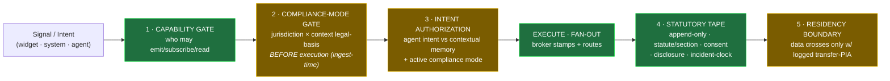
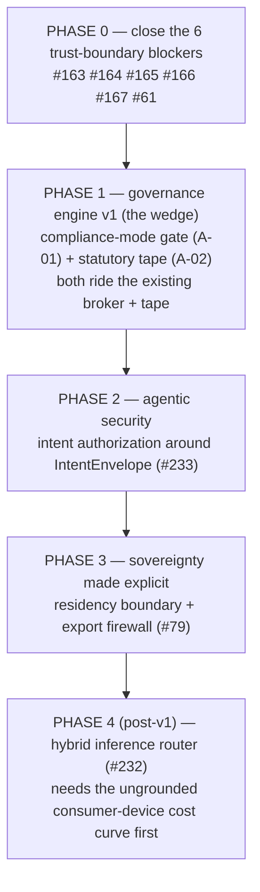
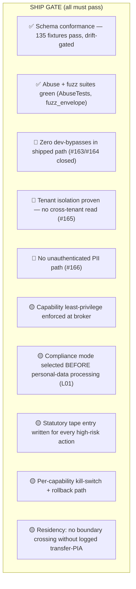

# Canvas as a native governance engine

## 0. The thesis (one decision)

T6 says the technical wedge is easy and the **governance wall** kills OS-layers. The Canada legal
layer turns that into two P0 directives — a **compliance-mode router** (`gate`) and a **statutory
control ledger** (`tape`). The codebase already has the exact chokepoint these want to live at:
the **Canvas Broker** — *"the only authority for envelope stamping, capability enforcement, fan-out,
telemetry tap"* (`apps/mac/Sources/CanvasBroker/Broker.swift`).

> **Recommendation:** do **not** bolt governance on as middleware or a post-hoc audit. Extend the
> broker into a single **native enforcement engine** every signal passes through, in order. This is
> what "native, like an engine for it" means: capability + compliance + intent + provenance +
> residency enforced as **one pass at the bus**, not scattered across call sites. It is also the one
> thing incumbents add late (and small teams can build in from line one) — so it is the wedge.

## 1. The native engine pipeline (recommended)

🟢 green = exists in some form today · 🟡 amber = architectural step to build. The **order matters**:
compliance-mode is selected *before* execution (Canada lesson L01: gate before execution, not audit
after), and intent-authz runs *inside* the active compliance mode (T6 lesson 7: agentic security is
intent-level, not API-level).

## 2. Current state — what ships today vs what's needed

### ✅ Production-ready end-to-end TODAY (the foundation is real)
| Capability | Where | Evidence |
|---|---|---|
| Canvas Protocol ABI (9 schemas, `matchPattern`) | `packages/canvas-protocol` v0.3.0 | 135 conformance fixtures, fuzz/conformance/drift test suites, dedicated CI (`canvas-protocol.yml`, `drift-detect.yml`); no stubs |
| Broker: envelope stamping · capability enforcement · fan-out · telemetry tap | `apps/mac/.../CanvasBroker/Broker.swift` (Swift actor) | 27 Swift test files incl. `AbuseTests`; most mature client surface |
| Tape: append-only E2EE governance log, tenant-scoped, idempotent on `(tenant_id, signal_id)` | `backend-rust/crates/canvas-backend/src/governance.rs` | integration tests (`abuse.rs`, `fuzz_envelope.rs`); `begin_tenant_txn`; backend CI |
| Identity: RS256 JWT vs JWKS (cached, **no dev bypass**) + tenant row-isolation | `backend-rust/.../auth.rs` | hardened in `bbf9dce`/`4c37ae6`; `SessionInvariant` now carries tenantId+userSub |
| Gate: capability enum + rate limiting | `Capability.json`, `rate_limit.rs` (tower_governor), Swift `TokenBucket` | enforced at broker + backend |

### 🔴 BLOCKERS — must close before ANY ship (Apple-level gate, §4)
| # | Exposure | File |
|---|---|---|
| #163 | JWT signature **not verified** in signing-service | `crates/signing-service/src/auth.rs:8` |
| #164 | `SIGNING_DEV_ALLOW_ALL` disables auth, no prod guard | signing-service |
| #165 | cross-tenant unaudited `/api/leads` bulk export | backend |
| #166 | unauthenticated `/api/auth/client/me` returns hardcoded PII | backend |
| #167 | unvalidated `X-Forwarded-For` (rate-limit/audit spoof) | backend |
| #61  | CRM still on **mock auth** (P0) | `apps/crm` |

> These are not "tech debt" — they are live trust-boundary holes. An Apple-level bar cannot ship a
> governance engine while auth can be bypassed. **Close all six before promoting any new primitive.**

### 🟡 ARCHITECTURAL STEPS — the native primitives to build
| Primitive | What it is | Lives in | Maps to | Notes |
|---|---|---|---|---|
| **Compliance-mode gate** | jurisdiction (fed/prov) × context (health/public/consumer/payment) router selecting legal controls **before** execution | broker pipeline step 2 + `canvas-backend` | regulation-canada **A-01 (P0)**; GH #57, #60 | NEW construct. New schema `ComplianceMode` + capability check. Ingest-time (L01). |
| **Statutory control ledger** | every high-risk signal links to statute/section · consent state · disclosure artifact · incident clock | extends tape (`GovernanceEntry`) | regulation-canada **A-02 (P0)**; #213, governance ADRs | base tape ✅ exists; add typed ledger fields + section refs |
| **Intent authorization** | authorize an agent's *intent* vs contextual memory + active compliance mode (gen-2 security) | broker step 3 + `IntentEnvelope` | T6 lesson 7; #233 (Command Bar/IntentEnvelope) | `IntentEnvelope` schema ✅ exists; **authz model unbuilt** |
| **Residency boundary** | first-class data-sovereignty edge; nothing crosses without a logged transfer-PIA | broker step 5 + backend egress control | GDPR Art.44 / QC P-39.1; #57, #79 export firewall; cloud egress | today only *implicit* via E2EE (ADR-054); make it a **named construct** |
| **Hybrid inference router** | on-device for light/privacy, cheap cloud ($0.10/M) for bulk, frontier for hard reasoning | `ml` layer | cloud `wm-cl-ad-hybrid-router`; #232 (deferred) | **deferred from v1** per #213/#212 — correct; sequence after the gate |

## 3. Sequencing (respects #213 native-primary + v1 ML-deferral)

Phases 1–3 add **no new chokepoint** — they thicken the one the broker already owns. Phase 4 is
gated on closing the high-severity cloud blindspot (consumer-device $/token is ungrounded).

## 4. Apple-level QA & gating — the bar before shipping any capability

A capability is shippable only when **every** box is green. Most mechanisms already exist (✅); the
gate is making them mandatory per-capability.

**Gating rules (recommended):**
1. **CI-enforced, not reviewer-judgment.** Conformance + drift + abuse/fuzz already block merge; add
   a `governance-gate` check that fails if a capability touches personal data without a compliance
   mode + tape entry (Q7/Q8) — make the invariant executable.
2. **No `*_DEV_ALLOW_ALL` / unverified-JWT code path reachable in a release build.** Static-check it.
3. **Every `op:1` claim that a P0 directive rests on must clear the T9 dialectic before the directive
   ships** — don't build on un-red-teamed beliefs (the identity + moats clusters are the gap).
4. **Severity-h blindspots block the dependent capability.** Phase 4 stays closed until the
   consumer-device inference curve is measured.

## 5. What I did NOT do (governance)

- Opened **no** GitHub issues (human-gated per `governance/` + repo CLAUDE.md). The 🟡 primitives map
  to existing epics (#213, #233, #232, #57, #79, #60) or warrant new ones — your call to promote.
- Edited **no** code in `sales-landing-page`. This is a recommendation artifact in `logic-research`.
- The compliance-mode/statutory-ledger field designs are **sketches**, not schemas — Phase 1 should
  start with a `specify-factory` pass on the `ComplianceMode` + ledger envelope before implementation.

---
*Reads with: [`viz/00-world-map.md`](viz/00-world-map.md), [`viz/01-t6-assumptions-understandings.md`](viz/01-t6-assumptions-understandings.md), [`blindspots.register.json`](blindspots.register.json).*
