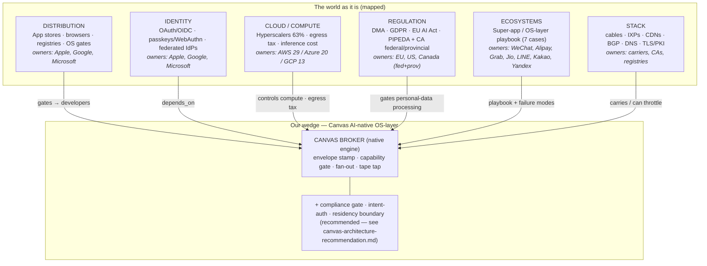
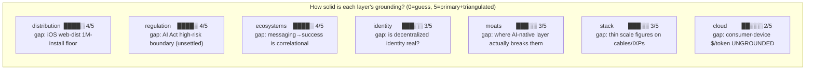
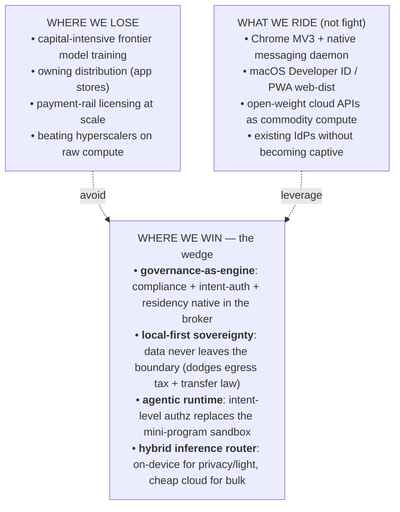

# The Map of the Mountain — where an AI-native OS-layer plugs in

> One picture of the seven layers we mapped, who controls each, the must-pass chokepoints
> (`op:1`), and the narrow wedge a small team can actually win. Facts trace to `notes/<layer>.jsonl`;
> robustness scores and the wedge are **my elicited synthesis** — read with the blindspots register.

## 1. The layered world + where Canvas rides

## 2. Must-pass chokepoints (`op:1` flags from the sweeps)

| Layer | `op:1` | The chokepoint(s) we must ride or route around |
|---|---:|---|
| identity | 9 | Apple/Google FIDO tunnel servers, federated IdP capture, passkey sync lock-in |
| moats | 9 | Apple/Google/MS distribution + switching-cost + network-effect moats |
| distribution | 2 | Chrome Web Store (MV3), macOS Gatekeeper/notarization |
| stack | 2 | DNS / TLS-PKI control points |
| cloud | 1 | **on-device ⇄ cloud inference cost crossover** (~$7.15/M local ≈ $6.90/M OpenAI; open-weight $1.97/M) |
| ecosystems | 1 | mini-program runtime → **agentic runtime** shift |
| regulation | 0* | *no `op:1`, but 2 **P0 arch_directives**: compliance-mode router (gate), statutory control ledger (tape)* |

> `op:1` = flagged for the expensive T9 adversarial dialectic. 23 claims are queued; only a subset
> has been red-teamed. The identity + moats clusters (18 of 23) are the least-tested, highest-stakes.

## 3. Robustness per layer (0–5, elicited) + biggest gap

*Scores reflect source tier × triangulation, not importance. Cloud is newest/thinnest; regulation
and distribution are best-grounded (primary law text + dev docs). See `blindspots.register.json`.*

## 4. The wedge — where a small AI-native team wins

**The thesis in one line:** *the technical wedge is easy; the governance wall is where OS-layers
die (T6). So the wedge is to make the governance wall a **native engine primitive** — the one thing
incumbents bolt on late and small teams can build in from line one.*

## 5. Honesty layer — what this map cannot yet see

- 🔴 **High severity:** the cloud inference crossover is a *model*, not measured; the consumer-device
  cost curve (the input our hybrid-router depends on) is **ungrounded**.
- 🟡 Most facts are **single-sourced**; the T9 dialectic has cleared only a subset of the 23 `op:1`.
- 🟡 "messaging → super-app success" is **correlational** (T6 base-rate caveat; the C01 myth).
- 🟡 EU AI Act high-risk classification for OS AI features is **unsettled in law** — not closeable by research.

→ full register: [`artifacts/blindspots.register.json`](../blindspots.register.json)

---
*Next viz: [`01-t6-assumptions-understandings.md`](01-t6-assumptions-understandings.md) — the picture
of what we assume vs. what we now understand. Then the build bridge:
[`canvas-architecture-recommendation.md`](../canvas-architecture-recommendation.md).*
