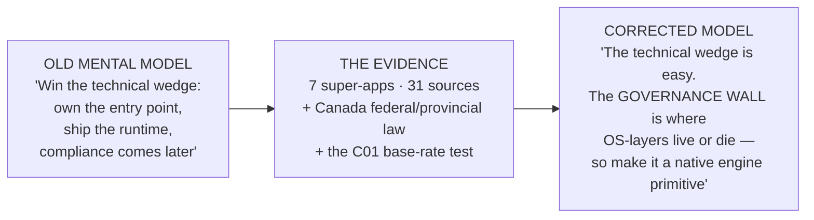
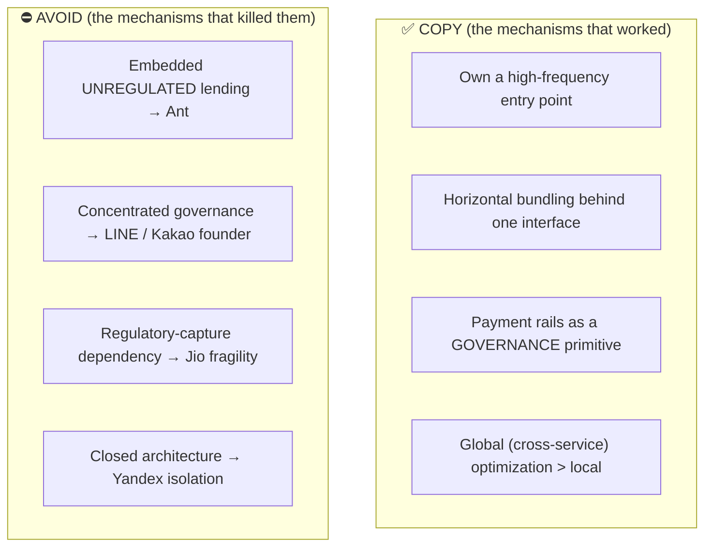
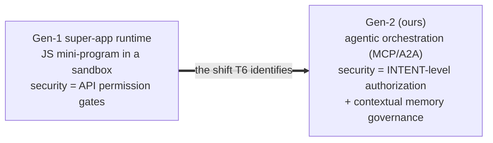

# T6 — What we assumed vs. what we now understand

> The super-app/OS-layer playbook (7 ecosystems, 31 sources) plus the Canada legal layer killed or
> revised eight beliefs. This is the picture: each assumption we walked in with, the reality the
> evidence forced, and the lesson (**T6.1**) that should now shape the Canvas engine.

## The one-line reframe

Every one of the seven hit a governance crisis at scale, not a technical one:
**Ant Group** $313e9 IPO → $0 (regulatory annihilation); **LINE** 510K-user breach → forced parent
divestiture (national-security); **Kakao** shared 40M+ users with Alipay → ruled illegal.
*The wall is real, and it is governance.*

## The eight assumptions → understandings → lessons

| # | We assumed… | The evidence showed… | Lesson (T6.1) → engine target |
|---|---|---|---|
| 1 | **Messaging** is what drives super-app success | Correlational only. Alipay (payments), Grab (ride-hail), Jio (telecom), Yandex (search) won **without** messaging; WhatsApp had messaging, never became one | Anchor on **high-frequency interaction** (conversation/agentic), not "messaging." *(kills the C01 myth)* → **product** |
| 2 | The hard part is the **technical wedge** | Tech wedge is easy; all 7 hit a **governance crisis** at scale | Build **governance as a primitive**, from line one → **gate + tape** |
| 3 | Compliance can be **deferred** to post-launch legal review | Canada L01: purpose/legal-basis gating must happen **at ingest-time in code paths** | **Gate before execution**, not audit after → **gate** |
| 4 | **One broad onboarding consent** covers most functions | Canada L02: consent must be **granular, revocable, context-specific** (msg/install/health/public/consumer) | **Compliance-mode router** (jurisdiction × context) → **gate** |
| 5 | Wallet/payments are **product + fraud** concerns | Canada L03 + Ant: payments are **first-class regulated infrastructure** (RPAA/AML) from day one; embedded unregulated lending = annihilation | **Structurally separate** financial services → **sovereignty/distribution** |
| 6 | Ranking/defaults are **pure growth optimization** | Canada L04 + Competition Act s.79: as power rises, ranking/default/steering become **competition-governance** surfaces | **Governed ranking** (logged, non-self-preferencing) → **gate + tape** |
| 7 | The runtime is a **JS mini-program sandbox** with API permission gates | T6: next-gen is **agentic orchestration** (MCP/A2A); a compromised agent acts autonomously | Security shifts from API gates to **intent-level authorization + contextual memory governance** → **gate (intent) + ml** |
| 8 | **Closed/captured** architecture is a moat (Yandex, Jio) | Closed → geopolitical isolation + user resentment; regulatory-capture dependency is **fragile** | Stay **interoperable**; never bet on political winds → **protocol** |

## What to copy / avoid (the playbook, distilled)

## The agentic difference (why our runtime is not a sandbox)

> **Implication for Canvas:** the `IntentEnvelope` (schema already exists in `canvas-protocol`, epic
> #233) is the right primitive — but the **authorization model around intent** is the unbuilt part.
> An agent that clears a capability gate can still do harm if its *intent* isn't authorized against
> contextual memory + the compliance mode. This is the gen-2 security model.

## Base-rate sidebar — the honesty the dialectic demands

The T6 artifact's own SKEPTICISM section flags it: **"messaging entry point → super-app success" is
correlational.** Reasoning from 3 messaging winners ignores the messaging-only non-starter (WhatsApp)
and the no-messaging winners (Alipay, Grab, Gojek, Jio, Yandex). This is the same failure the C01
prototype dialectic caught (thesis 0.55 vs antithesis 0.86 → **MYTH**). We carry the corrected belief
(#1 above), not the myth.

🔵 *Weak data, logged: profitability of the model is unproven (Grab "fragile"); non-English sources
(Yandex/Jio) rely on translation; sample over-represents current incumbents.*

---
*Bridge to build: [`canvas-architecture-recommendation.md`](../canvas-architecture-recommendation.md)
turns lessons 2–7 into native engine primitives, marked production-ready vs architectural-steps.*
