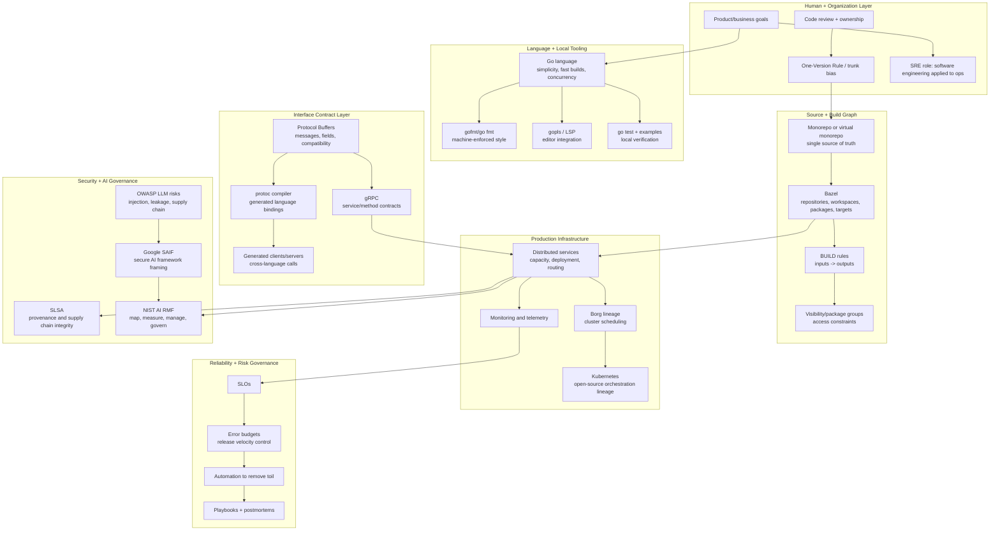

# 50-Node UI Compiler - Framework Grounding

## Reframe

The thing to fight is the unbounded prompt-to-app jump.

`Build me Salesforce as a frontend` should fail to compile, even if the generated React looks good, because the compiler identifies more than 50 conceptual nodes and only one surface tranche was mapped. That failure is not a UX problem. It is the first correct diagnostic: good code, bad understanding.

The system should force this move:

```text
one vague product request
-> discovered node universe
-> max-50-node compile blocks
-> independent swimlanes
-> completed graph chunks
-> generated framework surfaces
-> runtime evidence
```

For a Salesforce-class system, the compiler should not pretend the user asked for "a frontend." It should say: "I found roughly 500 nodes. You need 10 independent layers or swimlanes before code generation is meaningful."

## Answer To The Last Two Design Questions

The language should not simplify relationships. It should make relationships explicit enough that the compiler can generate the ugly implementation. Humans should not write the 25,000 branch cases by hand; humans should bin the real-world meaning into bounded chunks, accept or reject AI-proposed paths, and resolve ambiguity where the graph cannot infer intent safely.

The transformer can be a governance layer, but not the final governor. It should analyze transformations: malicious code drift, suspicious generated paths, ontology mismatch, policy bypass, and supply-chain anomalies. Deterministic compiler/runtime checks still decide what is legal. Neural governance is adaptive; compiler governance is final.

## The 50-Node Rule

The 50-node limit is a cognition boundary, not a storage limit.

A compile block is valid only when a human and AI can inspect it together:

| State | Meaning |
|---|---|
| `discovered` | The AI or human identified a possible node/path. |
| `binned` | The node belongs to one bounded block or swimlane. |
| `typed` | The node has a primitive kind and schema. |
| `linked` | Required paths are declared. |
| `constrained` | Authority, state, cost, and policy rules are explicit. |
| `compiled` | The compiler can emit code/tests/contracts. |
| `evidenced` | Runtime can trace effects back to nodes. |

If a block exceeds 50 nodes, the compiler returns a decomposition error, not code.

```text
CompileError::TooManyNodes {
  requested: "build me Salesforce",
  identified_nodes: 512,
  mapped_nodes: 1,
  required_action: "split into independent swimlanes",
  suggested_swimlanes: [
    "account-contact ontology",
    "lead intake",
    "opportunity lifecycle",
    "territory assignment",
    "forecasting",
    "approval policy",
    "activity timeline",
    "reporting",
    "integration contracts",
    "audit/export governance"
  ]
}
```

## UI As The Language

The UI is the language surface. Text is only an annotation layer.

The user works with natural nodes and paths:

- `Entity`: account, opportunity, invoice, deployment, policy.
- `Role`: sales rep, manager, admin, approver, service account.
- `State`: draft, qualified, proposed, closed won, revoked.
- `Transition`: qualify lead, close opportunity, rotate key.
- `Capability`: nameable action that can be granted.
- `Constraint`: authority, cost, privacy, timing, invariants.
- `Effect`: write, notify, export, deploy, sign, revoke.
- `Evidence`: journal row, audit event, test, proof, provenance.

The UI should not ask humans to "code." It should ask them to complete graph chunks. The AI suggests completions; the human accepts meaning; the compiler refuses incoherence.

## Day 0 And Day 1

Day 0 is not a full frontend framework. Day 0 is the existing engine direction running this grammar internally:

- node/path IR
- capability vocabulary
- intent/outcome gate
- durable journal
- audit trace
- mapper promotion rules
- graph visualizer

Day 1 is an independent frontend framework that can stand beside React rather than hide inside prompts:

- Vite plugin for graph chunks, HMR, and generated source projection.
- React surface for inspector/editor/runtime preview.
- TanStack Router projection for type-safe routes, search params, loaders, and workflow URLs.
- Generated SDK/MCP-like contract for external agents and tools.
- LSP/custom package for AI co-authoring with scope-specific graph completions.

`ctx7` grounding matters here: React Compiler points toward removing manual UI optimization work; TanStack Router shows route/search semantics can be made compile-time visible; Vite exposes the plugin/dev-server/HMR layer needed for a Day-1 framework.

## Compiler Return

The compiler should return more than code.

| Projection | Output |
|---|---|
| `sdk` | Typed methods for compiled capabilities. |
| `mcp` | Tool contracts for agents. |
| `ui` | Routes, components, forms, inspectors. |
| `db` | Migrations, indexes, row policies. |
| `test` | State transition tests and oracle cases. |
| `policy` | Authority and outcome gates. |
| `audit` | Journal/audit schemas and trace maps. |
| `docs` | Human-readable schema and review pages. |

The SDK/MCP surface is a projection. The source of truth is the node/path graph.

## Sidecar Hardening

The research agent's strongest correction is that "Google's Go framework" is a misleading phrase. Go is one layer inside a production engineering system. The enforceable relationships are imports, build dependencies, code ownership, generated schemas, review approvals, tests, SLOs, labels, rollout state, and provenance. These are control surfaces, not conceptual buckets.

That matters for the 50-node compiler because a neat ontology graph is not enough. A node/path block is only real when at least one downstream mechanism can enforce or observe it:

| Node/path claim | Required executable anchor |
|---|---|
| `depends_on` | Build graph, import graph, package metadata, or generated contract. |
| `owned_by` | Review rule, codeowner rule, policy grant, or approval record. |
| `calls` | IDL/service contract, typed SDK method, or runtime trace. |
| `runs_on` | deployment spec, scheduler label, or environment contract. |
| `reliable_enough` | SLO, error budget, monitor, and incident path. |
| `safe_to_generate` | tests, policy gate, provenance, and supply-chain evidence. |

If the compiler cannot map a relationship to one of these anchors, it should keep the relationship as a hypothesis rather than compile it.

## Google/Go As A Real-World Framework

The crawled sources show that Google-scale engineering is not one framework. It is an ecosystem of constraints that make large systems tractable: Go reduces language/tooling complexity; `gofmt` removes style debate; monorepo or one-version practice controls time/version complexity; Bazel makes build relationships explicit; protobuf/gRPC make cross-language interfaces compile; SRE turns reliability into measurable risk budgets; SLSA/SAIF/NIST/OWASP name supply-chain and AI risk governance.



## Mapping Back To The 50-Node Compiler

Google's pattern validates the direction: durable engineering comes from forcing implicit complexity into explicit layers.

| Google pattern | Our equivalent |
|---|---|
| Go simplicity and `gofmt` | UI grammar and compiler-normalized graph chunks. |
| One-Version Rule | One canonical graph state per compiled system slice. |
| Bazel packages/targets/rules | Node blocks, paths, and generated artifacts. |
| Protobuf/gRPC IDL | Capability vocabulary and SDK/MCP projection. |
| SRE error budgets | Compiler/runtime risk budgets and release gates. |
| SLSA provenance | Graph-to-code-to-runtime evidence chain. |
| NIST AI RMF | Map/measure/manage/govern loop for AI co-authoring. |
| OWASP LLM risks | Dredging, injection, leakage, and supply-chain checks. |

## AI Dredging Risks

AI dredging is when the model finds plausible structure because it can, not because the domain requires it.

Failure modes:

- The AI overfits to visible frameworks and imports Salesforce-shaped assumptions into non-Salesforce businesses.
- The AI treats industry schemas as truth instead of defaults requiring human acceptance.
- The AI fills missing paths to make the graph compile instead of surfacing ambiguity.
- The AI discovers too many nodes and hides them behind a good-looking frontend.
- The AI optimizes for code generation success instead of ontology correctness.

Countermeasures:

- Every AI-suggested node starts as `suggested`, not `accepted`.
- Every compile block carries `mapped_nodes / identified_nodes`.
- A block cannot compile if unresolved authority, effect, or evidence nodes remain.
- Industry schemas are imported as templates with provenance, not as canonical truth.
- The compiler must support a `null hypothesis`: "this system should not be generated yet."
- The transformer can score suspicious transformations, but deterministic gates reject illegal transitions.

## Hardening Rules

1. A prompt cannot compile directly to app code if the inferred graph exceeds 50 nodes.
2. Every node belongs to exactly one active block and may reference other blocks only through typed paths.
3. Every block declares its swimlane: ontology, workflow, authority, UI, data, integration, reliability, security, audit, or deployment.
4. Every generated artifact points back to node IDs.
5. Every external framework import enters as a schema pack with source provenance and version.
6. Every transformer suggestion is logged as a proposal with accept/reject evidence.
7. Every effect has authority, outcome bounds, and audit policy before code generation.
8. Every compile failure is useful: it returns the missing layer, not generic "invalid input."

## First Framework Shape

The first independent frontend framework should be narrow:

```text
logic-ui/
  graph.schema.json
  block.schema.json
  compiler/
    parse_graph
    validate_block
    split_swimlanes
    project_react
    project_router
    project_sdk
    project_policy
  vite-plugin/
  react-inspector/
  lsp/
```

The first app should be a graph workbench, not a landing page:

- left: swimlane/block navigator
- center: node/path canvas
- right: compiler diagnostics
- bottom: generated projections and audit trace
- command layer: AI suggestions with provenance and accept/reject controls

## Research Caveats

The Go/Google material is a model, not a transplant. Google has centralized authority, engineering culture, internal infra, and scale-specific incentives that most companies do not. The useful lesson is not "copy Google." The useful lesson is that large systems survive by making hidden dimensions explicit: version, dependency, interface, reliability, risk, provenance, and ownership.

The 50-node compiler should therefore avoid framework worship. It should use frameworks as schema packs, not as destiny.
