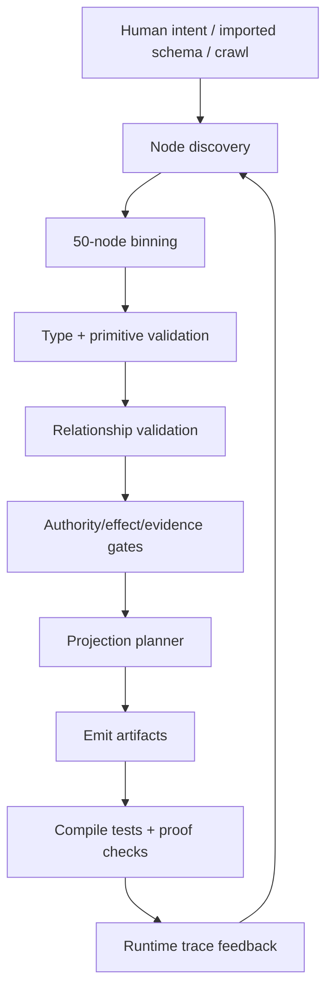

# Logic Graph Compiler - Overview

## Purpose

The compiler exists to stop unbounded natural-language requests from jumping straight to code.
It turns human and AI-authored node/path blocks into deterministic artifacts: UI, SDK methods,
policy checks, database shape, tests, and audit traces.

The central rule is the 50-node compile boundary:

```text
prompt or imported framework
-> discovered node universe
-> max-50-node block
-> validated graph IR
-> generated projections
-> runtime evidence
```

If the system identifies more than 50 nodes in a requested scope, compilation fails with a
decomposition diagnostic. This is intentional. A good-looking frontend with unmapped ontology is a
bad compile.

## Control Split

| Actor | Owns | Cannot Own |
|---|---|---|
| Human | meaning, risk appetite, final acceptance, domain truth | hidden branch logic |
| AI mapper | candidate nodes, relation suggestions, gap detection, schema import | legality |
| Compiler | graph validity, limits, projections, deterministic transforms | business meaning |
| Runtime | bounded effects, evidence, drift reporting | changing the source graph |

The neural model owns possibility. The compiler owns legality. The human owns meaning.

## Compiler Pipeline



## Compile Contract

A block compiles only if it has:

- no more than 50 active nodes;
- one declared swimlane;
- typed nodes and typed paths;
- executable anchors for key relationships;
- explicit authority and effect bounds;
- a generated test or proof obligation;
- traceability from generated artifact back to node/path ids.

## Day 0

Day 0 is internal and boring:

- define graph/block schemas;
- run the relationship mapper over local docs and `crwl` outputs;
- force >50-node requests into decomposition errors;
- generate markdown diagnostics and JSON IR;
- keep all AI suggestions as proposals until accepted.

## Day 1

Day 1 is a local frontend framework:

- Vite plugin for graph block loading and HMR;
- React graph workbench for node/path completion;
- typed router projection for workflow URLs;
- generated SDK/MCP-like surface for agents;
- local Ollama relationship mapper;
- Rust or TypeScript compiler core with deterministic validation.

## Non-goals

- Do not build a visual programming toy that only replaces text with boxes.
- Do not let a model compile directly to production code.
- Do not treat framework schemas as truth. They are templates with provenance.
- Do not make MCP the center. MCP is one generated projection.
